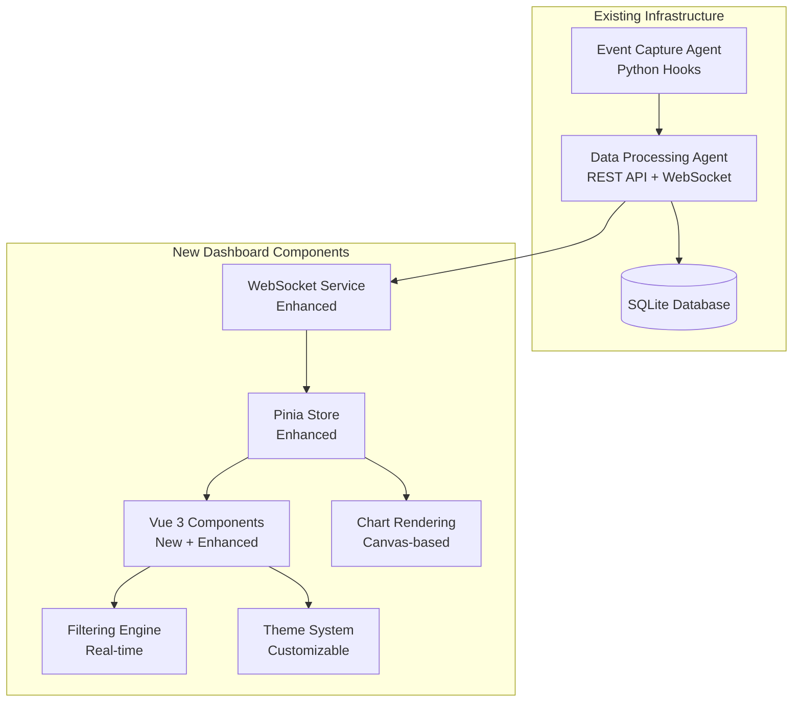

# Design Document

## Overview

The Real-time Observability Dashboard completes the Multi-Agent Observability System by implementing a comprehensive Vue 3 web application with WebSocket-based real-time monitoring. The solution integrates with the existing Data Processing Agent to provide live visualization of multiple concurrent Claude Code agents through an intuitive, responsive interface.

The design leverages the existing infrastructure (SQLite database, REST API, WebSocket server) and builds upon the partially implemented Vue 3 dashboard to create a production-ready monitoring solution.

## Architecture

### System Integration



### Component Architecture

The dashboard follows a modular architecture with clear separation of concerns:

1. **Service Layer** - WebSocket communication and API integration
2. **State Management** - Pinia stores for reactive data management
3. **UI Components** - Reusable Vue 3 components with composition API
4. **Visualization Layer** - Custom canvas-based charts for performance
5. **Filtering System** - Real-time event filtering and search
6. **Theme Engine** - Dynamic UI customization

## Components and Interfaces

### 1. Enhanced WebSocket Service

**Purpose**: Robust real-time communication with automatic reconnection and heartbeat monitoring

**Key Features**:
- Exponential backoff reconnection strategy
- Heartbeat/ping-pong mechanism for connection health
- Message queuing during disconnection
- Subscription management for selective event streaming

**Interface**:
```typescript
interface WebSocketService {
  connect(url: string, handlers: WebSocketEventHandlers): WebSocket
  send(message: WebSocketMessage): boolean
  subscribe(eventType: string): void
  unsubscribe(eventType: string): void
  requestRecentEvents(limit: number): void
  close(): void
  isConnected(): boolean
}
```

### 2. Enhanced Observability Store

**Purpose**: Centralized state management with real-time data synchronization

**Key Features**:
- Real-time event collection with memory management (max 1000 events)
- Agent status tracking and health monitoring
- Performance metrics calculation
- Filter state management
- WebSocket connection state management

**State Structure**:
```typescript
interface ObservabilityState {
  events: DatabaseEvent[]
  agents: AgentInfo[]
  stats: EventStats
  connectionState: ConnectionState
  filters: FilterOptions
  metrics: DashboardMetrics
}
```

### 3. Dashboard Layout Components

#### Main Dashboard View
- **Header**: Connection status, agent count, real-time indicators
- **Sidebar**: Agent list with status indicators and quick filters
- **Main Content**: Tabbed interface with different views
- **Footer**: System status and performance metrics

#### Agent Status Grid
- **Agent Cards**: Individual agent status with tech stack indicators
- **Status Indicators**: Active (green), Idle (yellow), Disconnected (red)
- **Quick Actions**: Filter by agent, view agent details
- **Performance Metrics**: Response time, event count, session count

### 4. Real-time Event Components

#### Event Timeline
- **Live Event Stream**: Real-time scrolling list of events
- **Event Cards**: Expandable cards with event details
- **Event Types**: Color-coded by event type (PreToolUse, PostToolUse, etc.)
- **Security Alerts**: Highlighted dangerous command blocks

#### Event Details Modal
- **Full Event Data**: JSON payload with syntax highlighting
- **Event Context**: Related events in the same session
- **Performance Data**: Execution time, resource usage
- **Security Analysis**: Command validation results

### 5. Visualization Components

#### Real-time Charts (Canvas-based)
- **Event Timeline Chart**: Time-series visualization of event frequency
- **Agent Activity Chart**: Per-agent event distribution
- **Event Type Distribution**: Pie chart of event types
- **Performance Metrics**: Response time trends

**Chart Features**:
- Smooth animations using requestAnimationFrame
- Time-bucketed data aggregation for performance
- Interactive tooltips and zoom functionality
- Responsive design for different screen sizes

#### Performance Dashboard
- **System Metrics**: Database size, connection count, memory usage
- **Agent Performance**: Average response times, error rates
- **Security Monitoring**: Blocked commands, security violations
- **Trend Analysis**: Historical performance patterns

### 6. Advanced Filtering System

#### Filter Interface
- **Quick Filters**: Predefined filters for common use cases
- **Advanced Search**: Full-text search across event payloads
- **Time Range Picker**: Custom date/time range selection
- **Multi-select Filters**: Agent, event type, session combinations

#### Real-time Filtering Engine
```typescript
interface FilterEngine {
  applyFilters(events: DatabaseEvent[], filters: FilterOptions): DatabaseEvent[]
  searchEvents(events: DatabaseEvent[], query: string): DatabaseEvent[]
  getFilterSuggestions(events: DatabaseEvent[]): FilterSuggestions
}
```

### 7. Theme Management System

#### Theme Structure
```typescript
interface Theme {
  id: string
  name: string
  colors: {
    primary: string
    secondary: string
    background: string
    surface: string
    text: string
    accent: string
    warning: string
    error: string
    success: string
  }
  typography: ThemeTypography
  spacing: ThemeSpacing
}
```

#### Theme Features
- **Predefined Themes**: Light, Dark, High Contrast
- **Custom Theme Editor**: Visual theme creation interface
- **Theme Persistence**: Local storage and server-side storage
- **Live Preview**: Real-time theme application
- **Theme Sharing**: Export/import functionality

## Data Models

### Enhanced Event Model
```typescript
interface EnhancedDatabaseEvent extends DatabaseEvent {
  // Computed fields
  duration?: number
  isSecurityEvent: boolean
  agentInfo: AgentInfo
  relatedEvents: DatabaseEvent[]
  performanceMetrics: EventPerformanceMetrics
}
```

### Agent Information Model
```typescript
interface AgentInfo {
  id: string
  name: string
  type: 'web_application' | 'data_analysis' | 'infrastructure'
  tech_stack: string[]
  status: 'active' | 'idle' | 'disconnected'
  last_seen: string
  session_count: number
  event_count: number
  avg_response_time: number
  health_score: number
}
```

### Dashboard Metrics Model
```typescript
interface DashboardMetrics {
  total_events: number
  active_agents: number
  avg_response_time: number
  events_per_minute: number
  security_violations: number
  system_health: 'healthy' | 'warning' | 'critical'
  uptime: number
}
```

## Error Handling

### WebSocket Error Handling
1. **Connection Failures**: Automatic reconnection with exponential backoff
2. **Message Parsing Errors**: Graceful error handling with user notification
3. **Network Timeouts**: Heartbeat monitoring with connection recovery
4. **Server Unavailable**: Offline mode with cached data display

### UI Error Handling
1. **Component Error Boundaries**: Prevent cascade failures
2. **Data Loading States**: Loading indicators and skeleton screens
3. **API Error Display**: User-friendly error messages
4. **Graceful Degradation**: Partial functionality during errors

### Performance Error Handling
1. **Memory Management**: Event list truncation and cleanup
2. **Chart Performance**: Frame rate monitoring and optimization
3. **Large Dataset Handling**: Virtualization and pagination
4. **Browser Compatibility**: Feature detection and fallbacks

## Testing Strategy

### Unit Testing
- **Vue Components**: Vue Test Utils with Jest
- **Pinia Stores**: Store action and getter testing
- **Services**: WebSocket service and API client testing
- **Utilities**: Filter engine and data transformation testing

### Integration Testing
- **WebSocket Communication**: End-to-end message flow testing
- **Real-time Updates**: Event propagation and UI update testing
- **Filter Functionality**: Complex filter combination testing
- **Theme System**: Theme application and persistence testing

### E2E Testing
- **Dashboard Loading**: Initial data loading and display
- **Real-time Monitoring**: Live event streaming and visualization
- **User Interactions**: Filter application and chart interactions
- **Multi-agent Scenarios**: Concurrent agent monitoring

### Performance Testing
- **Chart Rendering**: Frame rate and memory usage testing
- **Large Dataset Handling**: Performance with 1000+ events
- **WebSocket Throughput**: High-frequency event handling
- **Memory Leak Detection**: Long-running session testing

## Security Considerations

### Data Security
- **Event Data Sanitization**: XSS prevention in event display
- **WebSocket Security**: Origin validation and rate limiting
- **Theme Security**: CSS injection prevention in custom themes
- **Local Storage**: Secure storage of sensitive configuration

### Access Control
- **Connection Authentication**: WebSocket connection validation
- **API Security**: Request validation and rate limiting
- **Theme Sharing**: Secure theme import/export
- **Admin Functions**: Protected maintenance endpoints

## Performance Optimization

### Frontend Performance
- **Virtual Scrolling**: Efficient large list rendering
- **Canvas Optimization**: Efficient chart rendering with RAF
- **Component Lazy Loading**: Code splitting for faster initial load
- **Memory Management**: Event cleanup and garbage collection

### Real-time Performance
- **Event Batching**: Batch processing of high-frequency events
- **Selective Updates**: Only update changed components
- **Debounced Filtering**: Prevent excessive filter operations
- **Connection Pooling**: Efficient WebSocket resource usage

### Data Processing
- **Client-side Filtering**: Reduce server load with local filtering
- **Data Aggregation**: Time-bucketed data for chart performance
- **Caching Strategy**: Intelligent caching of computed values
- **Background Processing**: Web Workers for heavy computations

## Accessibility Features

### WCAG 2.1 Compliance
- **Keyboard Navigation**: Full keyboard accessibility
- **Screen Reader Support**: ARIA labels and descriptions
- **Color Contrast**: High contrast theme options
- **Focus Management**: Proper focus handling in modals

### Responsive Design
- **Mobile Optimization**: Touch-friendly interface
- **Flexible Layouts**: Adaptive grid system
- **Scalable Typography**: Responsive font sizing
- **Progressive Enhancement**: Core functionality without JavaScript

## Deployment Considerations

### Development Environment
- **Hot Module Replacement**: Fast development iteration
- **Mock Data**: Development mode with simulated events
- **Debug Tools**: Vue DevTools integration
- **Environment Configuration**: Flexible API endpoint configuration

### Production Environment
- **Build Optimization**: Tree shaking and minification
- **CDN Integration**: Static asset optimization
- **Error Monitoring**: Production error tracking
- **Performance Monitoring**: Real-time performance metrics

### Browser Support
- **Modern Browsers**: Chrome 90+, Firefox 88+, Safari 14+, Edge 90+
- **WebSocket Support**: Fallback for older browsers
- **ES6+ Features**: Babel transpilation for compatibility
- **Progressive Web App**: Service worker for offline functionality